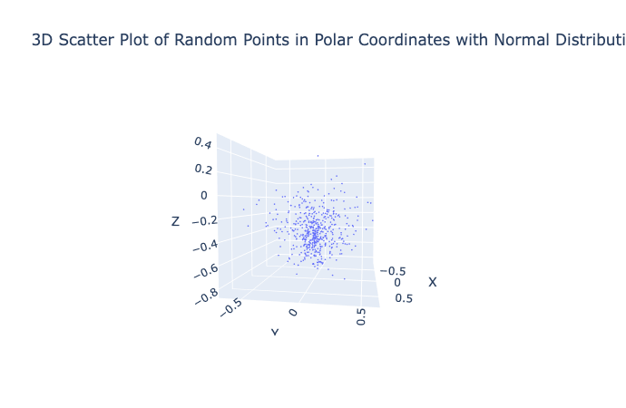
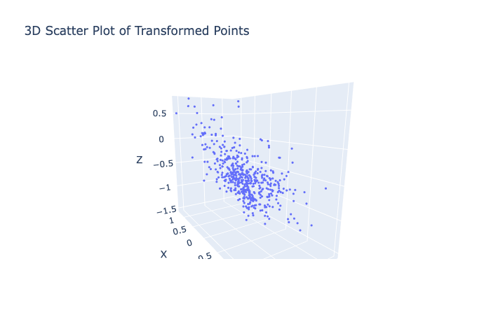

[](http://quantlet.de/)

## [](http://quantlet.de/) **3Drandompolar** [](http://quantlet.de/)

```yaml

Name of QuantLet : '3Drandompolar'

Published in : 'Data-Science-math-less-Digital-Society' 

Description : 'the normal 3D random plot'

Keywords : 'normal, plotly'

Author : 'WK Haerdle Zuo Xiaorui'

Submitted : Wed, Jan 10 2024
```





### [IPYNB Code: 3Drandompolar.ipynb](3Drandompolar.ipynb)


automatically created on 2024-01-11