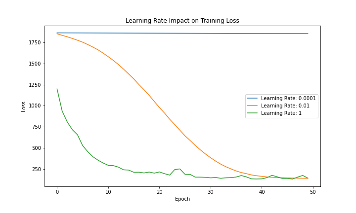
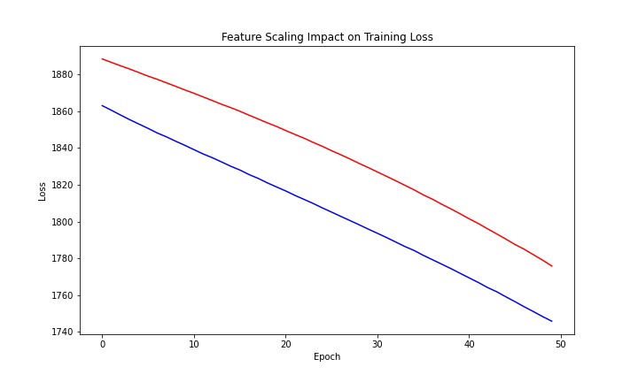

[](http://quantlet.de/)

## [](http://quantlet.de/) **MLMessUp** [](http://quantlet.de/)

```yaml

Name of QuantLet : 'MLMessUp'

Published in : 'Data-Science-math-less-Digital-Society' 

Description : 'Examples that ML can be messed up easily'

Keywords : 'scale, learning rate'

Author : 'WK Haerdle Zuo Xiaorui'

Submitted : Mon, Jan 15 2024
```





### [IPYNB Code: MLMessUp.ipynb](MLMessUp.ipynb)


automatically created on 2024-01-16