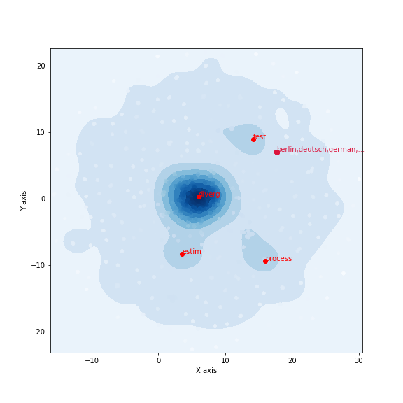

[](http://quantlet.de/)

## [](http://quantlet.de/) **umapwords** [](http://quantlet.de/)

```yaml

Name of QuantLet : 'umapwords'

Published in : 'Data-Science-math-less-Digital-Society' 

Description : 'Example of UMAP and BERT embedding'

Keywords : 'UMAP, BERT'

Author : 'WK Haerdle Zuo Xiaorui'

Submitted : Tue, Jan 16 2024
```



### [IPYNB Code: umapwords.ipynb](umapwords.ipynb)


automatically created on 2024-01-17